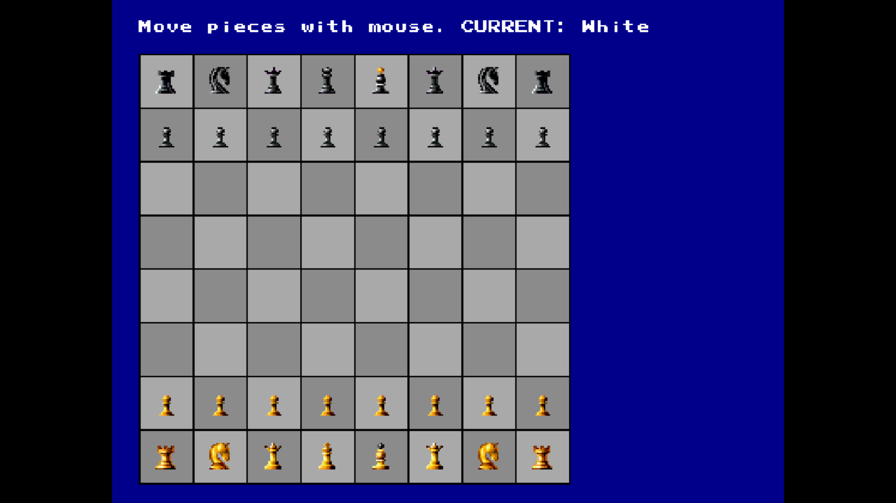
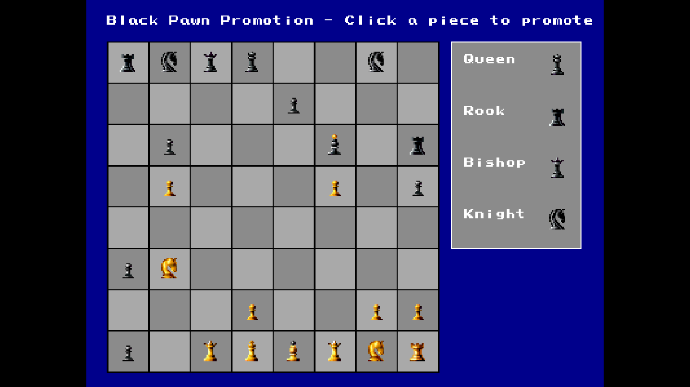
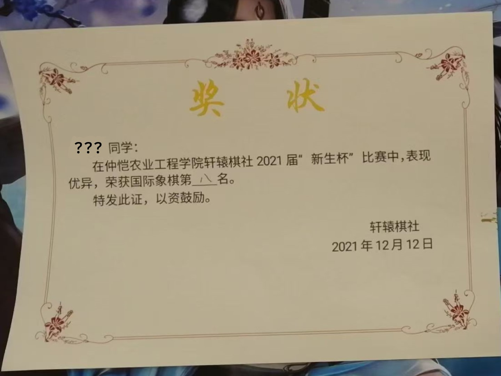

# Chess Game Built with `vbPixelGameEngine`




## Description
This project is a classic chess game developed using `vbPixelGameEngine` by [@DualBrain](https://github.com/DualBrain/), enabling two players to play chess in real-time on the same screen. Authentic gameplay mechanics like castling, en passant, and pawn promotion ensure a fair and enjoyable experience for all players.

Players can use the mouse to select and move pieces on the chessboard. The game concludes when one player checkmates the opponent or when a stalemate is reached. Press 'R' at any time to restart the game and 'ESC' to quit.

The sprite sheet for the chess pieces is sourced from [this page](https://www.spriters-resource.com/game_boy_advance/chessmaster/asset/184245/) on the Spriters Resource website. It has been reorganized using Aseprite to ensure compatibility with `DrawPartialSprite` based on the dimensions of each piece (12x16 px).

## Prerequisites
- [.NET SDK](https://dotnet.microsoft.com/download): version 9.0 or later
- IDE: Visual Studio 2022 or Visual Studio Code
- Required NuGet Package: System.Drawing.Common 9.0.0+

## How to Play
1. Clone the repository and navigate to the project directory:
```bash
git clone https://github.com/Pac-Dessert1436/VBPGE-Chess-Game.git
cd VBPGE-Chess-Game
```
2. Restore project dependencies:
```bash
dotnet restore
```
3. Compile the project and run the executable:
```bash
dotnet build
dotnet run
```
4. Both players take turns moving pieces with the mouse. Valid moves are highlighted with yellow dots when a piece is selected.
5. Hotkeys: 'R' to restart, 'ESC' to quit the game.

## Personal Notes
This game brings back memories of my first semester as a freshman. It was my curiosity that led me to sign up for the chess tournament organized by the Xuanyuan Board Game Association on campus. With only 8 participants, I was fortunate to receive a certificate even though I finished last. What's more, I was lucky enough to get to know Ms. Lin from Class 192 of the Agronomy Department. (Note: My full Chinese name written in the certificate is now hidden as a matter of privacy)



There's quite a story behind why I made this game. During my freshman year, I was eager to create my own Pac-Man game, filled with all kinds of ideas. Undoubtedly, game development turned out to be much more time-consuming and energy-draining than I had imagined. *__It involves not just programming but also music composition, and pixel art can get overly complicated, just like the chess game I'm struggling with right now.__* Back then, swamped with college courses, I had no idea where to start. It wasn't until a year or two later that I really grasped the essentials of coding.

To this day, game development remains just a hobby and can't become my career. As Ms. Lin once said to me, "Exceptional people focus on one thing at a time."

## License
This project is licensed under the MIT License. See the [LICENSE](LICENSE) file for details.